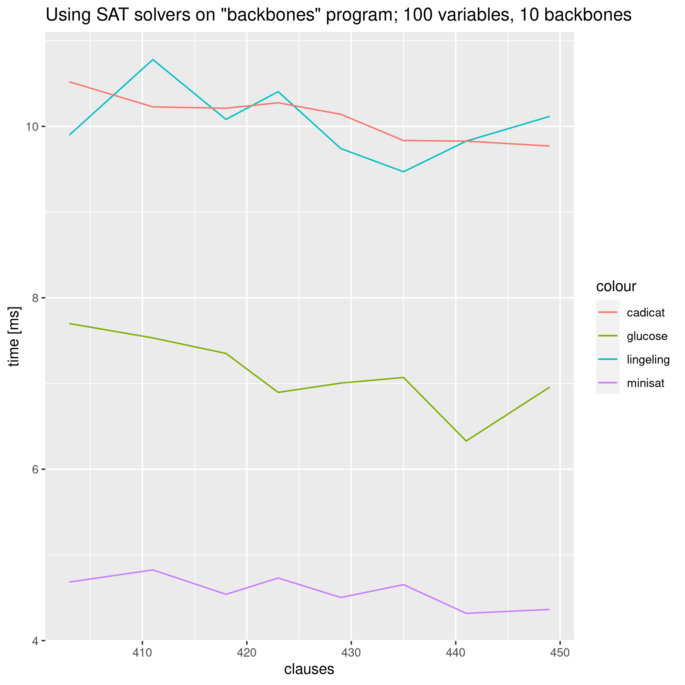
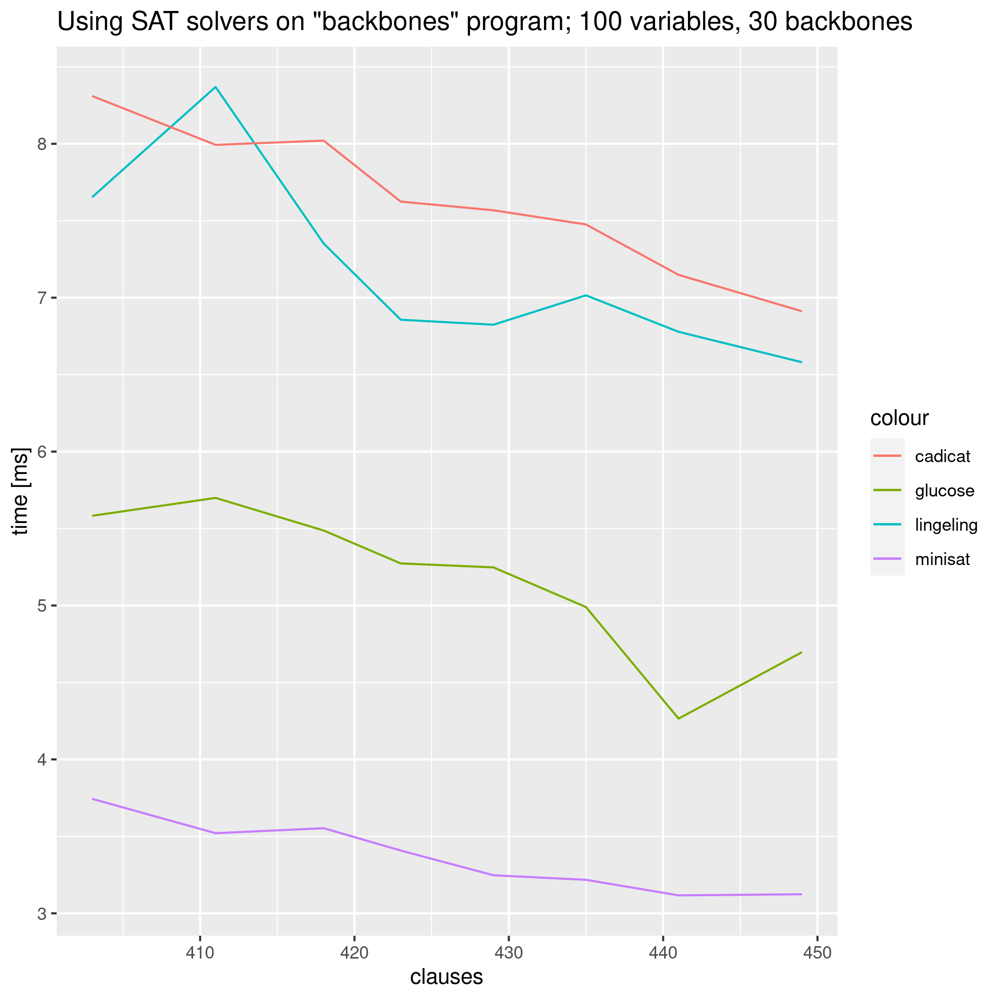
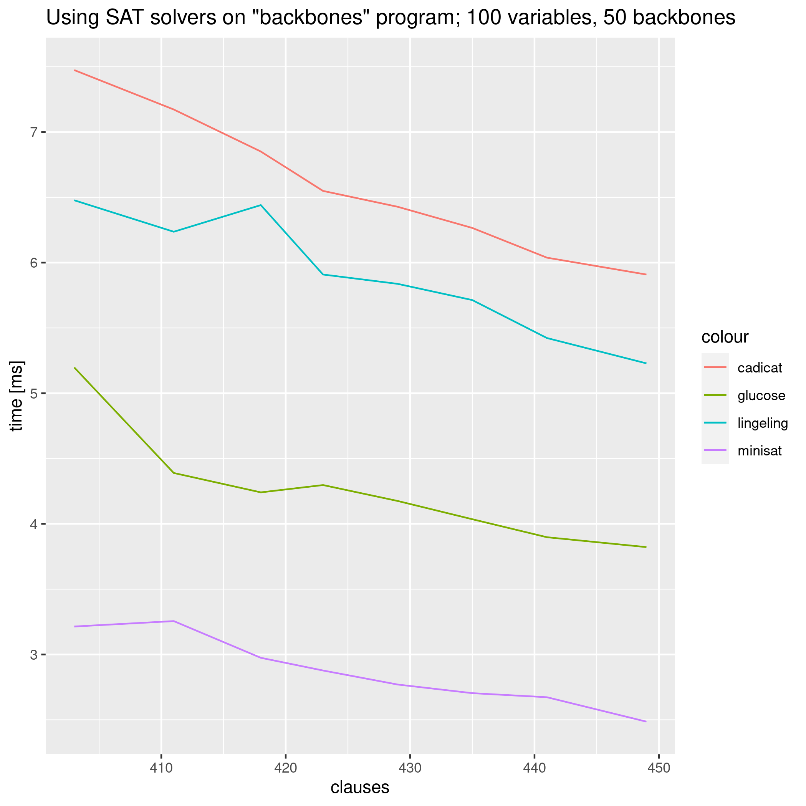
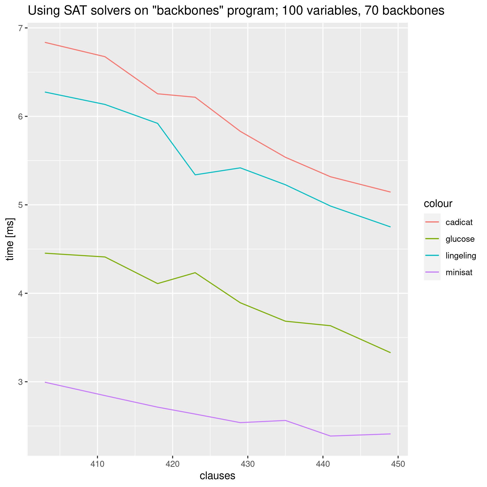
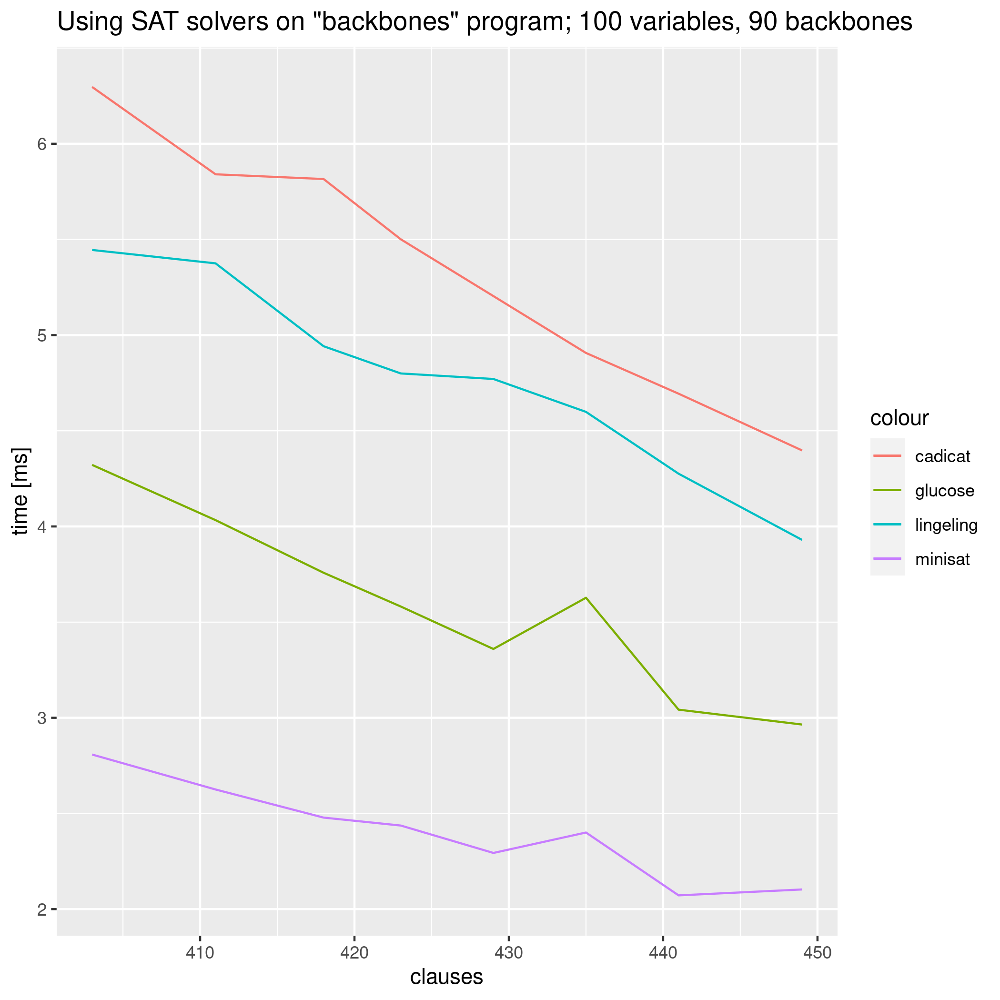
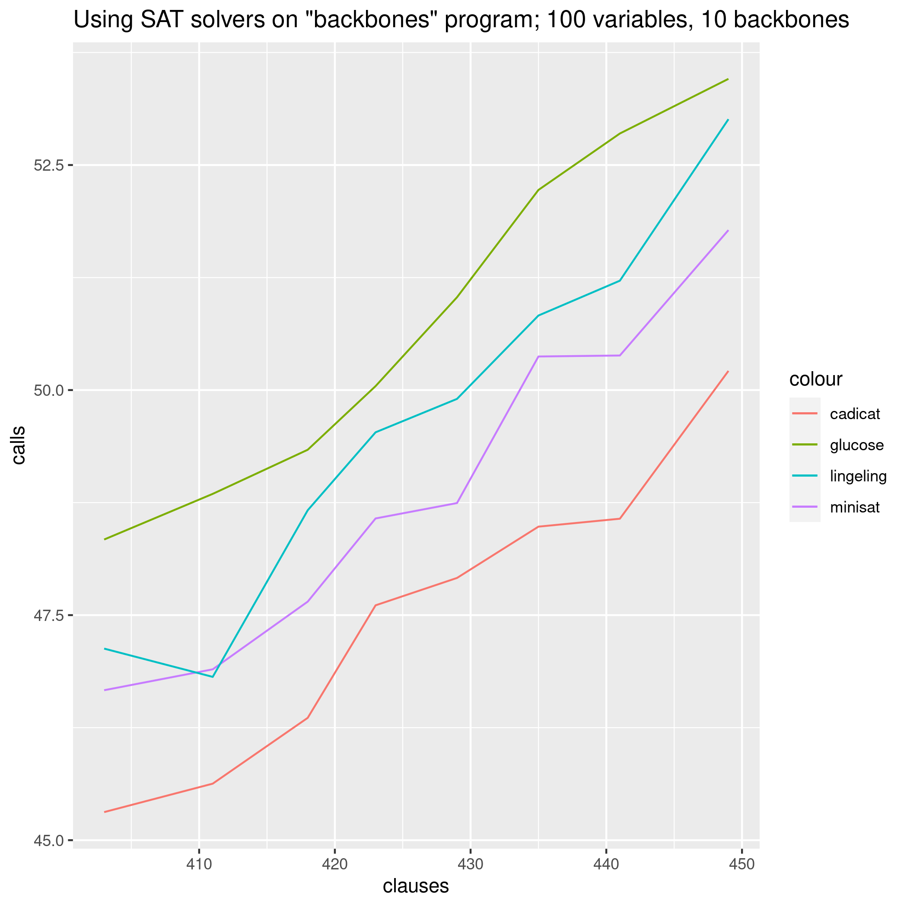
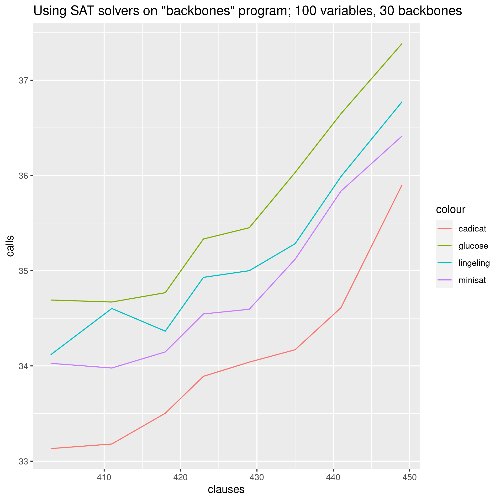
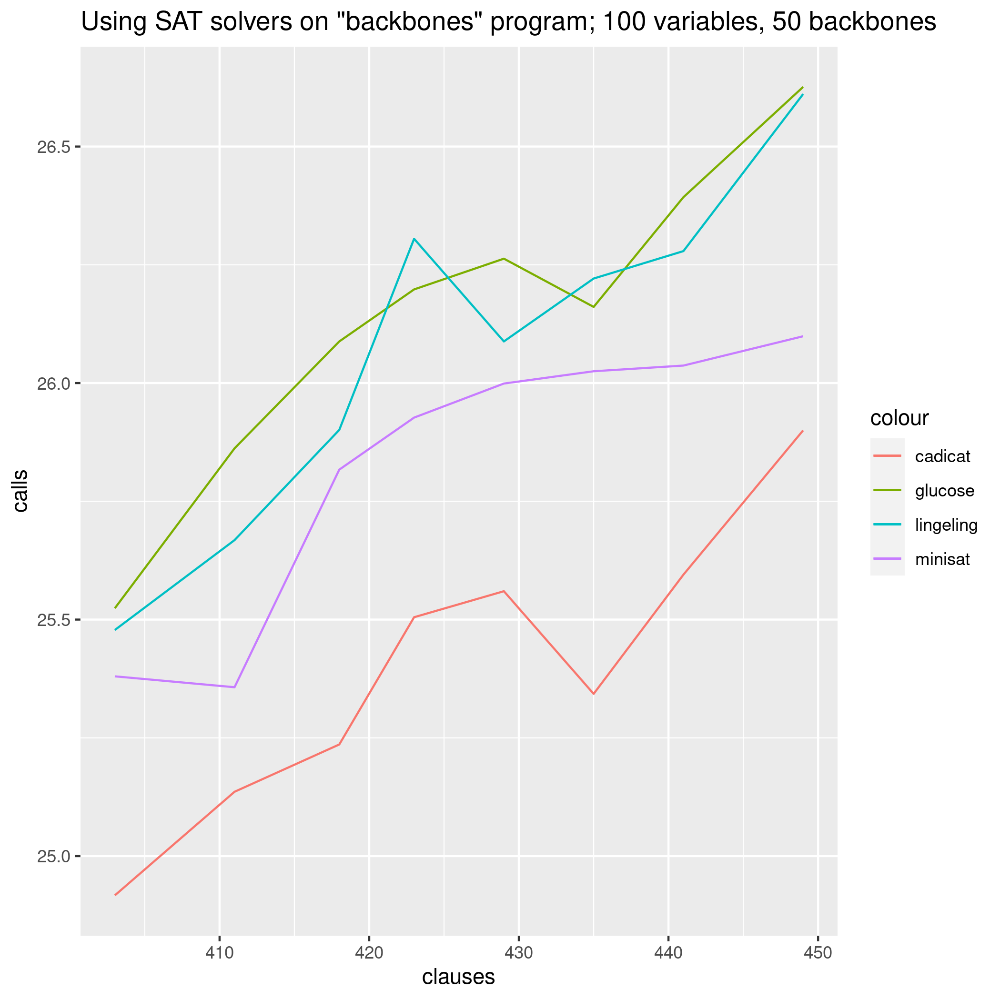
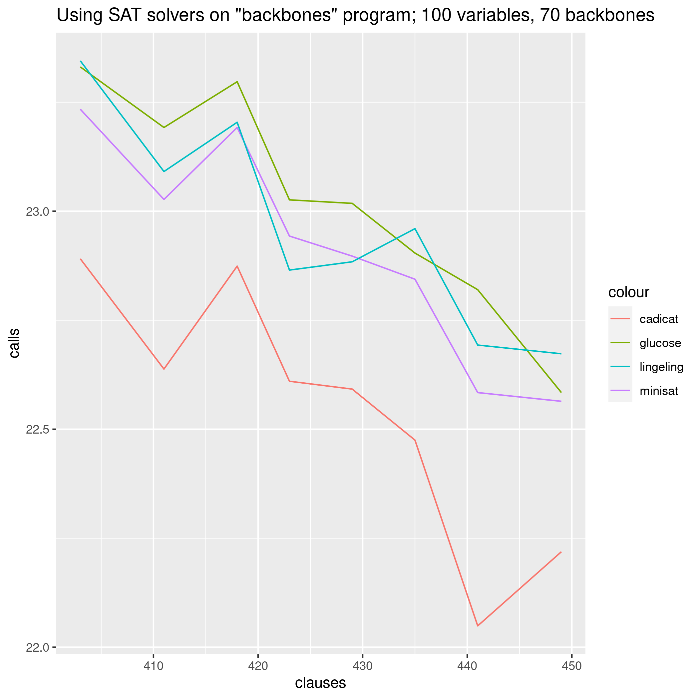
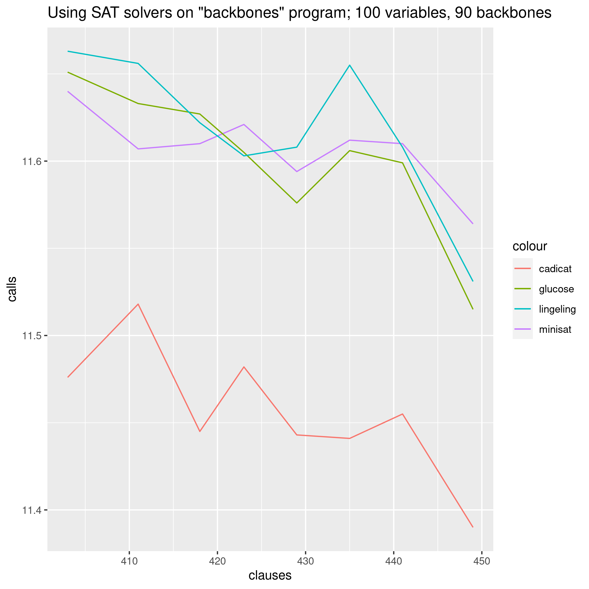

# Report for the "Backbones" assignment

## Algorithm

The algorithm is as follows:

1. Create a vector of suspected backbones = at first, all literals

    - we skip this in the actual implementation

2. Ask the SAT solver to give us a model. On failure, go to 6.
3. Update the vector of suspected backbones by eliminating the ones that are not in the assignment
4. Give the SAT solver a blocking clause requesting assignment of negation of one of the suspected backbones (we let the SAT solver choose)
5. return to 2.
6. If the original formula doesn't have a model, there are no backbones
7. Otherwise, we return the current vector of suspected backbones

## Implementation

The actual implementation skips the first step, but it follows this overall description in all of the variations.

The variations each use on of cadical, lingeling, minisat, and glucose. And their performance was measured on time and the number of calls.

The measurements were performed on [Controlled Backbone Size Instances](https://www.cs.ubc.ca/~hoos/SATLIB/Benchmarks/SAT/CBS/descr_CBS.html) (see [links.txt](links.txt) for the exact datasets)

## Time

We can clearly see that minisat outperformed its competitors in speed (just like in the previous assignment).

## Calls

If we used the naive approach by testing whether a formula can be satisfied without assigning a certain literal (after finding the first model), we would use, on average, ~76 calls (1 for the first model and then 50 if we were absolutely lucky and 100 if we were absolutely unlucky).

Here, cadical, the lookahead solver, is the best one. Which makes sense, as it uses more powerful heuristics (but which costs it a lot of time).

## Conclusion

The algorithm is very inefficient if there are very few backbones and a lot of possible models. We could perform much better with some awareness of the structure of the formula, but then we would do the work which is done by the solver anyway.
