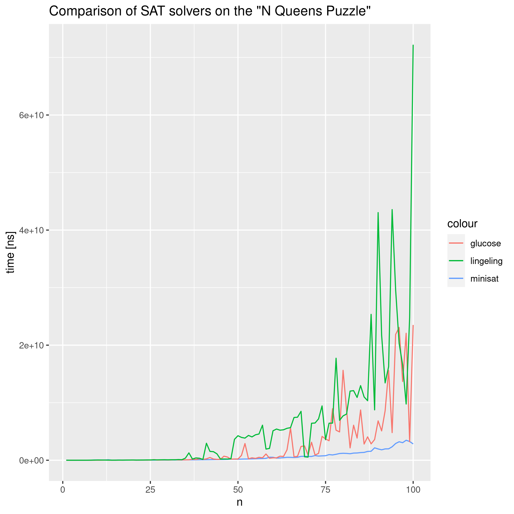

# Report for the "N Queens Puzzle" assignment

The problem was being solved by the following SAT solvers using their out-of-the-box configuration

- minisat
- glucose
- lingeling

The files containing the cnf form of the problem were generated by a cpp program [gen_queens.cpp](gen_queens.cpp).

## The results

The results were collected by running `make` which builds the generator of the cnf files and then runs the SAT solvers on them using [run.sh](run.sh).

Then the R script [script.R](script.R) generated the comparison plot:

The plot clearly shows that minisat found the proof for the problem much faster than its opponents, it finds the proof quite efficiently and its running time is extremely stable.

Lingeling seems to fail at finding an efficient proof and it seems the solution time for subsequent calls would be exponential. It spent 72.2 seconds finding the solution to queens-100.
